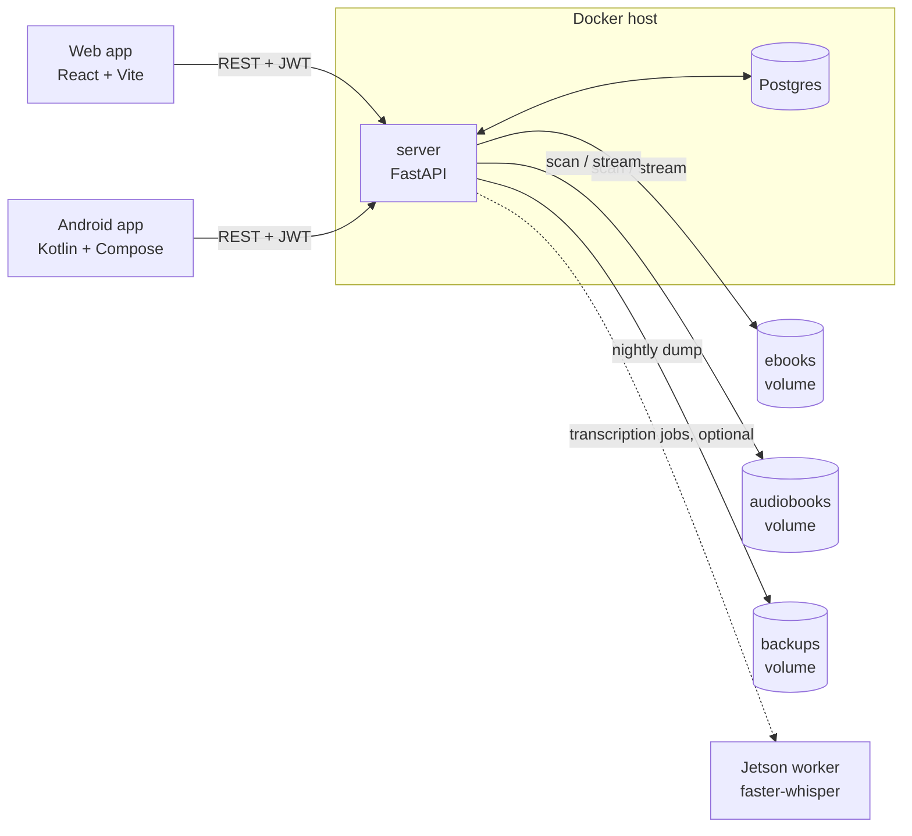

# Tandem

Synchronize your reading position between ebooks and audiobooks — switch seamlessly between
reading and listening. Tandem transcribes an audiobook, aligns the transcript to the ebook text,
and keeps a single position in sync across devices.

> **A note on the name.** The project used to be called BookSync and still answers to it in places
> that are expensive to rename: the Android package `com.booksync`, the Postgres role/database
> `booksync`, the `booksync_db`/`booksync_data` docker volumes, `booksync-db-*.dump` backup files,
> and the repo slug `Book-Sync`. Those are identifiers, not branding — leave them alone. Everything
> a user reads says Tandem.

## Architecture



The server owns everything stateful: it scans the two library volumes, extracts metadata, pairs
ebooks with audiobooks, runs the transcription queue, generates sync maps, and is the only writer
of reading position. Clients are thin — they read and write position through the server
(`PUT /api/sync/position/...`) and hold only device-local caches.

| Path | Stack | What it is |
|------|-------|------------|
| `server/` | Python · FastAPI · SQLAlchemy (async) · Postgres | API, auth/RBAC, transcription queue, sync engine, import sources |
| `web/` | Vite · React 18 | Web app (responsive — same codebase serves desktop and mobile) |
| `android/` | Kotlin · Jetpack Compose | Android reader/listener client |
| `jetson/` | Python | Remote transcription worker (optional, separate host) |

## Quick start

Use Docker Compose for the full stack (server + Postgres + web). Copy the template once, then
customize your paths/secrets — `docker-compose.yml` is gitignored so your local copy never
conflicts with future pulls:

```bash
cp docker-compose.example.yml docker-compose.yml
```

Edit `docker-compose.yml`: the ebook/audiobook/backup volume mounts, and the mandatory variables in
the table below. Then:

```bash
docker compose up --build
```

The server applies its Alembic migrations on start (`server/entrypoint.sh`), so there's no separate
schema step. **An existing database created before Alembic must be stamped once** —
`alembic stamp head` — or `upgrade head` will try to create tables that already exist.

### First run

1. **Get the admin password.** On a fresh database the server creates a single superadmin named
   `admin` with a **randomly generated** password and writes it to the log — it is never `admin`:

   ```bash
   docker compose logs server | grep -i superadmin
   ```

2. **Log in and reset it.** The account is flagged `must_reset_password`, so the web app sends you
   straight to a forced password-reset screen. You can't reach the rest of the UI until you do.
3. **Scan the library.** **System → Troubleshoot Library → Run Verification Scan** walks the
   mounted ebook and audiobook directories, extracts metadata, and auto-pairs what it can match.
   See [docs/library-conventions.md](docs/library-conventions.md) for the folder/filename patterns
   and the pairing rules.
4. **Fix up the pairs.** Anything ambiguous lands unpaired; pair it by hand under **Pairs →
   Unpaired**.
5. **Queue transcription.** Each pair needs a transcript before positions can be synced between the
   two formats. Queue it from the **Transcription** page, or turn on auto-transcribe to have new
   pairs queued automatically. See [docs/transcription.md](docs/transcription.md).

### Environment variables

Set in the `server` service's `environment:` block. Everything the server reads lives in
[`server/config.py`](server/config.py).

**Mandatory** — with `APP_ENV=prod` (the default) the server *refuses to start* without these:

| Variable | Why |
|---|---|
| `JWT_SECRET_KEY` | Signs access/refresh tokens. `python -c "import secrets; print(secrets.token_urlsafe(64))"` |
| `POSTGRES_PASSWORD` + matching `DATABASE_URL` | Startup rejects the shipped `booksync:booksync` credentials. `python -c "import secrets; print(secrets.token_urlsafe(32))"` |
| `CORS_ORIGINS` | Comma-separated web origins. Startup rejects the wildcard `*`. |
| `CREDENTIAL_ENC_KEYS` | Comma-separated Fernet keys encrypting import-source credentials (Audible auth blob, ABS token). First key encrypts, all are tried for decryption — rotation is "prepend a new key". `python -c 'from cryptography.fernet import Fernet; print(Fernet.generate_key().decode())'` |

Set `APP_ENV=dev` for local development to allow the insecure zero-config defaults. Never in prod.

**Optional** — all have working defaults:

| Variable | Default | What it does |
|---|---|---|
| `APP_ENV` | `prod` | `dev` permits default secrets and wildcard CORS |
| `EBOOK_DIR` / `AUDIOBOOK_DIR` | `/data/ebooks` / `/data/audiobooks` | Library roots (mount your real folders here) |
| `APP_DATA_DIR` / `COVERS_DIR` | `/data/app` / `/data/app/covers` | Extracted covers, working files |
| `IMPORTS_DIR` | `/data/imports` | ACSM import staging (inbox / processed / failed) |
| `BACKUPS_DIR` | `/backups` | Nightly + manual backups — mount this off the host disk |
| `TRANSCRIPTION_PROVIDER` | `remote_with_fallback` | `local`, `remote`, or `remote_with_fallback` |
| `TRANSCRIPTION_REMOTE_URL` | — | Jetson worker URL (port 9000) |
| `TRANSCRIPTION_REMOTE_TIMEOUT` | `7200` | Seconds before a remote job is abandoned |
| `WHISPER_MODEL` / `WHISPER_DEVICE` | `medium` / `auto` | Local Whisper model and device (`auto`/`cpu`/`cuda`) |
| `AUTO_TRANSCRIBE_ENABLED` | `false` | Queue newly auto-matched pairs automatically |
| `ALLOW_PUBLIC_REGISTRATION` | `true` | Self-registration; new accounts still need admin approval |
| `GOOGLE_BOOKS_API_KEY` | — | Raises the rate limit on the manual Google Books metadata search |
| `ABS_URL` / `ABS_API_TOKEN` / `ABS_AUDIOBOOKS_PREFIX` | — | Audiobookshelf metadata enrichment |

**The database wins over the environment for transcription settings.** Provider, remote URL/key,
timeout, Whisper model, auto-transcribe, and the off-hours window are all editable from
**System → Transcription Settings** in the web UI, and the stored value is what the queue uses
(defaults in [`server/routers/settings.py`](server/routers/settings.py)). The env vars above are
the first-boot values.

### Transcription: remote by default, local optional

The default server image is **remote-transcription-only** — it does **not** install the local
Whisper stack (`torch` + `openai-whisper`), whose CUDA wheels are multi-GB and slow to build.
Point transcription at the Jetson worker (`TRANSCRIPTION_PROVIDER=remote`; the default is
`remote_with_fallback`). To run Whisper on the server itself instead, build with the local stack:

```bash
docker compose build --build-arg INSTALL_LOCAL_WHISPER=1
```

(With a remote-only image, `remote_with_fallback` has no local fallback — it errors if the remote
is unreachable, so prefer `TRANSCRIPTION_PROVIDER=remote` unless you built with local Whisper.)

The Jetson Orin Nano worker deploys separately, on its own host — see
[jetson/README.md](jetson/README.md) for the sparse-clone-and-deploy walkthrough.

### Backups

The server dumps Postgres and snapshots covers to `/backups` on a nightly schedule (point that
mount at a NAS path off the host disk). Create manual backups, restore, download, delete, and
configure the schedule/retention from **System → Backups** in the web UI.
**Store `CREDENTIAL_ENC_KEYS`, `JWT_SECRET_KEY`, and `POSTGRES_PASSWORD` in your password
manager** — without the Fernet keys, the encrypted import-source credentials in a restored dump
can't be decrypted. Full details, monitoring, and the restore/test-drill procedure:
**[docs/backup-restore.md](docs/backup-restore.md)**.

## Documentation

| Doc | Covers |
|---|---|
| [docs/library-conventions.md](docs/library-conventions.md) | Supported formats, folder/filename patterns, metadata precedence, auto-pairing rules, format conversion |
| [docs/transcription.md](docs/transcription.md) | Provider modes, queue behavior, off-hours window, what affects runtime |
| [docs/android.md](docs/android.md) | Building the app, pointing it at your server, downloads/offline, Android Auto |
| [docs/operations.md](docs/operations.md) | Logs, upgrades, password rotation, restart policies |
| [docs/backup-restore.md](docs/backup-restore.md) | Backup schedule, restore procedure, test drills |
| [docs/position-sync-contract.md](docs/position-sync-contract.md) | The cross-device position rules — read before touching bookmark/progress writes |
| [docs/testing.md](docs/testing.md) | Test suites, fixtures, coverage policy |
| [jetson/README.md](jetson/README.md) | Deploying the remote transcription worker |

## Development & tests

Tests run in CI on every push/PR. **Write a failing test first**, then make it pass.

- **Server:** `cd server && pip install -r requirements.txt -r requirements-dev.txt && pytest`.
  Runs on SQLite — no Docker needed. Use `ptw` for the auto-rerun TDD loop.
- **Web:** `cd web && npx vitest run` (watch mode: `npm test`).
- **Android:** `cd android && ./gradlew :app:testDebugUnitTest`.
- **Jetson:** `cd jetson && python -m pytest test_server.py -v` — not in CI, run it manually when
  you touch `jetson/server.py`.
- **Coverage gates:** a global floor plus per-PR **patch coverage** (changed lines must be
  ≥80% covered). Full policy, the fixtures/helpers available, and how to write a test:
  **[docs/testing.md](docs/testing.md)**.

Sync-matching logic exists on both server and Android and is pinned by shared golden vectors in
`server/tests/fixtures/sync_parity/` — a change to one platform must update both.

Contributions should include tests for new/changed behavior — the PR template has the checklist.
