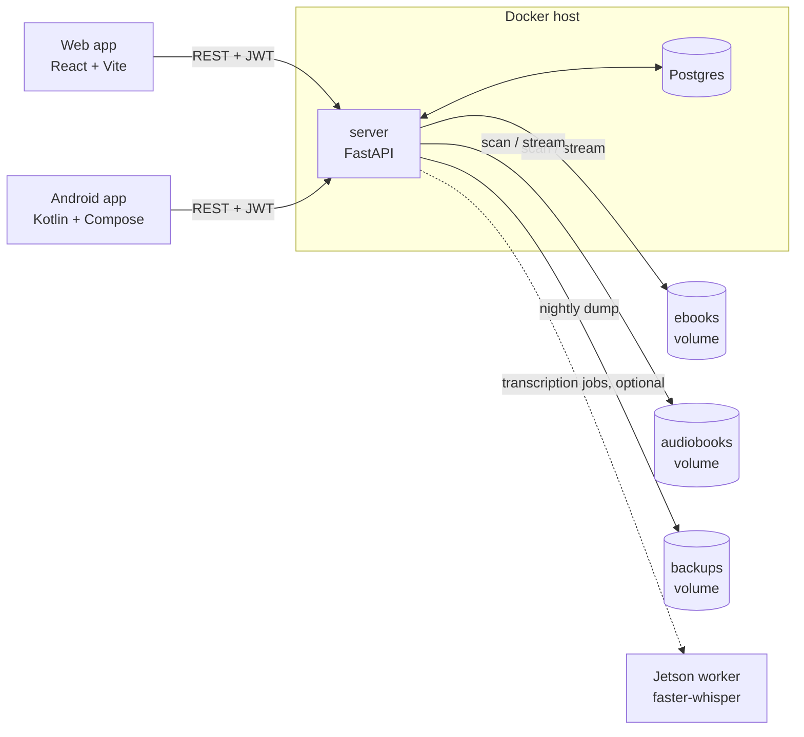

# Tandem

**Read a book, listen to the same book, and never lose your place.** Tandem is a self-hosted
server plus web and Android apps that keep *one* reading position across an ebook and its
audiobook. It transcribes the audiobook with Whisper, aligns the transcript to the EPUB text
sentence by sentence, and stores the position server-side — so you stop reading on the couch,
carry on listening in the car, and open either format again exactly where you left off. It
indexes books you already have on disk; nothing leaves your machine except the optional metadata
lookups you switch on yourself.

## Features

- **Sentence-level ebook ⇄ audiobook handoff** — switching format lands on the sentence you were
  on, not the chapter you were in, on every device.
- **Transcription queue** — Whisper on the server, or handed to a GPU worker on another host, with
  retries, an off-hours window and a transcript editor for fixing what it got wrong.
- **Library scanning and pairing** — recursive scan of your ebook/audiobook folders, metadata and
  cover extraction, series grouping, and automatic pairing of an ebook with its audiobook.
- **Web app** — EPUB reader and audio player in one React app, installable as a PWA with
  lock-screen controls. This is also the iPhone story: there is no iOS app.
- **Android app** — Readium reader, Media3 player, offline downloads, background playback and
  Android Auto.
- **Multiple users** — accounts with roles, admin approval for new sign-ups, per-user progress and
  bookmarks.
- **Optional integrations, each off until you configure it** — Audiobookshelf, Google Books and
  Open Library metadata, and ACSM/Audible imports of content you bought yourself (those need an
  opt-in image build — see [docs/import-sources.md](docs/import-sources.md)).
- **Backups** — nightly Postgres dumps and cover snapshots, restorable from the UI.

## Screenshots

**Pending.** No screenshots are committed yet, and this README will not fake them. The intended
set, to land under `docs/images/`:

| Planned file | Shows |
|---|---|
| `docs/images/library.png` | Library grid with covers, pairing state and series |
| `docs/images/reader.png` | EPUB reader with the switch-to-audio control |
| `docs/images/player.png` | Audio player with the switch-to-ebook control |
| `docs/images/transcription-queue.png` | Transcription queue mid-job |

Until then, run it and look — the quick start below brings the whole stack up in one command.

## Status

**Pre-release: 0.1.0, no tagged releases yet.** A single-maintainer project, built for and run on
one self-hosted deployment. It is in daily use and carries a real test suite, so it is not a toy —
but it has exactly one operator's worth of exposure, so expect rough edges on hardware and library
layouts unlike theirs.

- **Self-hosted only.** There is no hosted Tandem. You run the server; the apps are clients for
  *your* server and are useless without one.
- **APIs may change.** Server and clients speak an integer `api_version` handshake
  ([`server/version.py`](server/version.py)) and the app warns on a mismatch, but nothing is
  frozen before 1.0.
- **Distribution.** The Android app is not on Play yet — build and sideload it
  ([docs/android.md](docs/android.md)). Changes are recorded in [CHANGELOG.md](CHANGELOG.md); the
  release procedure is [docs/releasing.md](docs/releasing.md).

## Requirements

| You need | Details |
|---|---|
| A server | x86-64 Linux host with Docker and Docker Compose. Postgres + FastAPI + nginx; no GPU needed for the server itself. Disk for your library, and a backup mount off the host disk. |
| Somewhere to transcribe | Either a CUDA GPU host running the [Jetson worker](jetson/README.md) (an Orin Nano 8 GB is the reference; `medium` is the default model), or a server image built with the local Whisper stack, which is multi-GB and slow on CPU. Transcription is optional — without it you get a library and two readers, but no cross-format sync. |
| A browser | Any current desktop or mobile browser. Installable as a PWA. |
| Android 8.0+ | API 26 or newer, for the Android app. Optional — the web app works on a phone. |

## Known limitations

Read this before installing; most of it is by design and none of it is hidden.

- **EPUB only for sync.** `.pdf` files pair but never align; `.mobi`/`.azw3` are indexed but must
  be converted before they can be read or synced. See
  [docs/library-conventions.md](docs/library-conventions.md).
- **An audiobook is one file.** A book ripped as `01.mp3 … 30.mp3` is deliberately skipped, not
  imported — merge it to a single `.m4b` first.
- **One transcription at a time.** The queue is single-process by construction, and a book takes
  hours; there are no published numbers because the honest answer is "measure it on your
  hardware" ([docs/transcription.md](docs/transcription.md)).
- **The server runs as one process.** No horizontal scaling — it refuses to boot if the
  environment asks for more than one worker.
- **No iOS app.** The PWA is the iPhone story.
- **Android Auto is untested on hardware.** The media surface is implemented, but nobody has run
  it in a car or walked Google's car-app quality checklist against it (issue #172).
- **No crash reporting anywhere.** No Crashlytics/Sentry in the app, the web app or the server, so
  a crash you do not report is a crash nobody sees (issue #230).
- **Downloads and streaming are new.** The Android app streams when a book is not downloaded and
  auto-downloads the ebook on first open; that path landed recently and has had little mileage.
- **Nothing is in an app store.** Sideload the Android app; there is no signed public build yet.

## Architecture



The server owns everything stateful: it scans the two library volumes, extracts metadata, pairs
ebooks with audiobooks, runs the transcription queue, generates sync maps, and is the only writer
of reading position. Clients are thin — they read and write position through the server
(`PUT /api/sync/position/...`) and hold only device-local caches.

| Path | Stack | What it is |
|------|-------|------------|
| `server/` | Python · FastAPI · SQLAlchemy (async) · Postgres | API, auth/RBAC, transcription queue, sync engine, import sources |
| `web/` | Vite · React 18 | Web app (responsive — same codebase serves desktop and mobile) |
| `android/` | Kotlin · Jetpack Compose | Android reader/listener client |
| `jetson/` | Python | Remote transcription worker (optional, separate host) |

## Quick start

Use Docker Compose for the full stack (server + Postgres + web). Copy the template once, then
customize your paths/secrets — `docker-compose.yml` is gitignored so your local copy never
conflicts with future pulls:

```bash
cp docker-compose.example.yml docker-compose.yml
cp .env.example .env
```

Edit `docker-compose.yml`: the ebook/audiobook/backup volume mounts, and the mandatory variables in
the table below. Edit `.env`: set `POSTGRES_PASSWORD` — compose interpolates it into both the `db`
service and the server's `DATABASE_URL`, and Postgres refuses to initialise if it is empty. Both
files are gitignored. Then:

```bash
docker compose up --build
```

The server applies its Alembic migrations on start (`server/entrypoint.sh`), so there's no separate
schema step. **An existing database created before Alembic must be stamped once** —
`alembic stamp head` — or `upgrade head` will try to create tables that already exist.

> **Run the `server` service as a single process.** No `uvicorn --workers`, no `WEB_CONCURRENCY`, no
> second replica. The transcription queue claim, its cancellation state and the import/backup
> schedulers are all process-local, so a second worker transcribes the same audiobook twice and
> re-queues the other worker's running job. The server refuses to boot if the environment asks for
> more than one worker — see [docs/operations.md](docs/operations.md), "Single process only".

### First run

1. **Get the admin password.** On a fresh database the server creates a single superadmin named
   `admin` with a **randomly generated** password and writes it to the log — it is never `admin`:

   ```bash
   docker compose logs server | grep -i superadmin
   ```

2. **Log in and reset it.** The account is flagged `must_reset_password`, so you are sent straight
   to a forced password-reset screen. The flag is enforced by the **server**, not just the UI: until
   the password is changed the API refuses every route except `GET /auth/me`,
   `POST /auth/change-password` and `POST /auth/logout` with `403 password_reset_required`. That
   holds for the web app, the Android app and `curl` alike, so the temporary password cannot be used
   for anything else.
3. **Scan the library.** **System → Troubleshoot Library → Run Verification Scan** walks the
   mounted ebook and audiobook directories, extracts metadata, and auto-pairs what it can match.
   See [docs/library-conventions.md](docs/library-conventions.md) for the folder/filename patterns
   and the pairing rules.
4. **Fix up the pairs.** Anything ambiguous lands unpaired; pair it by hand under **Pairs →
   Unpaired**.
5. **Queue transcription.** Each pair needs a transcript before positions can be synced between the
   two formats. Queue it from the **Transcription** page, or turn on auto-transcribe to have new
   pairs queued automatically. See [docs/transcription.md](docs/transcription.md).

### Environment variables

Set in the `server` service's `environment:` block. Everything the server reads lives in
[`server/config.py`](server/config.py). The one exception is `POSTGRES_PASSWORD`: it is a compose
*interpolation* variable, read from a `.env` file next to `docker-compose.yml` (copy
[`.env.example`](.env.example)) and substituted into both the `db` service and `DATABASE_URL`.

**Mandatory** — with `APP_ENV=prod` (the default) the server *refuses to start* without these:

| Variable | Why |
|---|---|
| `JWT_SECRET_KEY` | Signs access/refresh tokens. `python -c "import secrets; print(secrets.token_urlsafe(64))"` |
| `POSTGRES_PASSWORD` + matching `DATABASE_URL` | Startup rejects the shipped `booksync:booksync` credentials. `python -c "import secrets; print(secrets.token_urlsafe(32))"` |
| `CORS_ORIGINS` | Comma-separated web origins. Startup rejects the wildcard `*`. |
| `CREDENTIAL_ENC_KEYS` | Comma-separated Fernet keys encrypting import-source credentials (Audible auth blob, ABS token). First key encrypts, all are tried for decryption — rotation is "prepend a new key". `python -c 'from cryptography.fernet import Fernet; print(Fernet.generate_key().decode())'` |

Set `APP_ENV=dev` for local development to allow the insecure zero-config defaults. Never in prod.

**Exposing the stack behind a reverse proxy?** Set `FORWARDED_ALLOW_IPS` to your proxy's address,
prefer putting the proxy (e.g. Caddy) on the compose network pointed at `server:8000`, and bind
the published `8000`/`3000` ports to `127.0.0.1` or your LAN firewall so the proxy can't be
bypassed. Details: [docs/operations.md → Reverse proxy](docs/operations.md#reverse-proxy).

**Optional** — all have working defaults:

| Variable | Default | What it does |
|---|---|---|
| `APP_ENV` | `prod` | `dev` permits default secrets and wildcard CORS |
| `EBOOK_DIR` / `AUDIOBOOK_DIR` | `/data/ebooks` / `/data/audiobooks` | Library roots (mount your real folders here) |
| `APP_DATA_DIR` / `COVERS_DIR` | `/data/app` / `/data/app/covers` | Extracted covers, working files |
| `IMPORTS_DIR` | `/data/imports` | ACSM import staging (inbox / processed / failed) |
| `BACKUPS_DIR` | `/backups` | Nightly + manual backups — mount this off the host disk |
| `TRANSCRIPTION_PROVIDER` | `remote_with_fallback` | `local`, `remote`, or `remote_with_fallback` |
| `TRANSCRIPTION_REMOTE_URL` | — | Jetson worker URL (port 9000) |
| `WHISPER_MODEL` / `WHISPER_DEVICE` | `medium` / `auto` | Local Whisper model and device (`auto`/`cpu`/`cuda`) |
| `AUTO_TRANSCRIBE_ENABLED` | `false` | Queue newly auto-matched pairs automatically |
| `ALLOW_PUBLIC_REGISTRATION` | `true` | Self-registration; new accounts still need admin approval |
| `LOGIN_FAILURE_LIMIT` / `LOGIN_FAILURE_WINDOW_SECONDS` | `10` / `900` | Failed logins per username before that username is 429'd for the rest of the window. Complements the per-IP limit; note that keying on the username lets anyone who knows one lock the real user out for the window, so don't lower it casually. See [docs/operations.md](docs/operations.md#login-throttling) |
| `FORWARDED_ALLOW_IPS` | `127.0.0.1` (uvicorn default) | Reverse-proxy peer(s) whose `X-Forwarded-For` uvicorn trusts. **Required behind any proxy** — unset, all clients share the proxy's IP, so the login rate limit is one global bucket and audit logs record the proxy. Never `*`. See [docs/operations.md](docs/operations.md#reverse-proxy) |
| `GOOGLE_BOOKS_API_KEY` | — | Raises the rate limit on the manual Google Books metadata search |
| `ABS_URL` / `ABS_API_TOKEN` / `ABS_AUDIOBOOKS_PREFIX` | — | Audiobookshelf metadata enrichment |

**Tokens and auth throttles** — sensible as they are; listed because they are settable, not
because you should set them:

| Variable | Default | What it does |
|---|---|---|
| `JWT_ALGORITHM` | `HS256` | Signing algorithm for access/refresh tokens |
| `JWT_ACCESS_TOKEN_EXPIRE_MINUTES` | `1440` | Access-token lifetime (24 h) |
| `JWT_REFRESH_TOKEN_EXPIRE_DAYS` | `30` | Refresh-token lifetime. Refresh tokens are **not** rotated on use |
| `JWT_MEDIA_TOKEN_EXPIRE_MINUTES` | `15` | Lifetime of the short-lived, resource-scoped token used for cover/audio URLs that cannot carry an `Authorization` header |
| `PASSWORD_CHANGE_FAILURE_LIMIT` / `PASSWORD_CHANGE_FAILURE_WINDOW_SECONDS` | `5` / `900` | Failed current-password checks on `/auth/change-password` before that user is throttled. Keyed on the authenticated user id, so a low limit is safe here — unlike the login one |
| `REFRESH_FAILURE_LIMIT` / `REFRESH_FAILURE_WINDOW_SECONDS` | `20` / `900` | Rejected `/auth/refresh` attempts per token subject before throttling. Only failures count |

**Upload limits** — layered with the proxy's own cap (see [`Caddyfile.example`](Caddyfile.example)):

| Variable | Default | What it does |
|---|---|---|
| `UPLOAD_MAX_BYTES` | `10737418240` (10 GiB) | Whole multipart body cap, refused with 413 *before* parsing |
| `MAX_UPLOAD_FILE_BYTES` | `4294967296` (4 GiB) | Per-file cap enforced while the file streams to disk. Keep it ≤ `UPLOAD_MAX_BYTES` |
| `MAX_COVER_BYTES` | `16777216` (16 MiB) | Per-file cap for cover images |

**Sync tunables — contract-locked.** These must stay equal to the clients' own constants; changing
one here alone makes the ebook and the audiobook disagree about where you are. Change both clients
too, and read [docs/position-sync-contract.md](docs/position-sync-contract.md) first:

| Variable | Default | What it does |
|---|---|---|
| `DEFAULT_REWIND_SECONDS` | `5` | How far back a text→audio handoff lands from the matched sentence (Android `PlaybackOffsets.RESUME_REWIND_MS`, web `RESUME_REWIND_SECONDS`) |
| `AUTO_COMPLETE_EPUB_PERCENT` | `98.0` | Reading past this percentage marks the book finished — back matter means 100% is rarely reached |
| `AUTO_COMPLETE_AUDIO_TAIL_SECONDS` | `120` | Listening to within this many seconds of the end marks the book finished |

**The database wins over the environment for transcription settings.** Provider, remote URL/key,
timeout, Whisper model, auto-transcribe, and the off-hours window are all editable from
**System → Transcription Settings** in the web UI, and the stored value is what the queue uses
(defaults in [`server/routers/settings.py`](server/routers/settings.py)). The env vars above are
the first-boot values.

### Transcription: remote by default, local optional

The default server image is **remote-transcription-only** — it does **not** install the local
Whisper stack (`torch` + `openai-whisper`), whose CUDA wheels are multi-GB and slow to build.
Point transcription at the Jetson worker (`TRANSCRIPTION_PROVIDER=remote`; the default is
`remote_with_fallback`). To run Whisper on the server itself instead, build with the local stack:

```bash
docker compose build --build-arg INSTALL_LOCAL_WHISPER=1
```

(With a remote-only image, `remote_with_fallback` has no local fallback — it errors if the remote
is unreachable, so prefer `TRANSCRIPTION_PROVIDER=remote` unless you built with local Whisper.)

The Jetson Orin Nano worker deploys separately, on its own host — see
[jetson/README.md](jetson/README.md) for the sparse-clone-and-deploy walkthrough.

### API docs are dev-only

With the default `APP_ENV=prod` the server serves **no** interactive schema: `/docs`, `/redoc` and
`/openapi.json` all return `404`. That is deliberate — the published container port is normally
reachable on the LAN even when the reverse proxy forwards only `/api/*`, and the full route
inventory is reconnaissance rather than a feature. Set `APP_ENV=dev` (local development only, where
it also relaxes the secret/CORS startup checks) to get Swagger UI back at `/docs`.

The reference that is always available is [docs/api.md](docs/api.md), with the generated
[docs/openapi.json](docs/openapi.json) alongside it.

### Backups

The server dumps Postgres and snapshots covers to `/backups` on a nightly schedule (point that
mount at a NAS path off the host disk). Create manual backups, restore, download, delete, and
configure the schedule/retention from **System → Backups** in the web UI.
**Store `CREDENTIAL_ENC_KEYS`, `JWT_SECRET_KEY`, and `POSTGRES_PASSWORD` in your password
manager** — without the Fernet keys, the encrypted import-source credentials in a restored dump
can't be decrypted. Full details, monitoring, and the restore/test-drill procedure:
**[docs/backup-restore.md](docs/backup-restore.md)**.

## Documentation

Full index with one line per document: **[docs/README.md](docs/README.md)**. Start there for the
library conventions, transcription, Android and web-PWA guides, the operations and backup runbooks,
the testing policy, and the position-sync contract. Deploying the remote transcription worker is
[jetson/README.md](jetson/README.md).

**[Privacy policy](docs/privacy.md)** — what the apps send and to whom. Short version: Tandem is
self-hosted, so the operator of the server you sign in to holds your data and we receive nothing;
no ads, no analytics, no crash-reporting SDK. The one third party the Android app contacts is the
dictionary service behind the reader's "Define" action, and only when you use it.

## Development & tests

Tests run in CI on every push/PR. **Write a failing test first**, then make it pass.

- **Server:** once per clone or worktree, `cd server && ./setup-testenv.sh` — it provisions the
  exact interpreter CI uses (`server/.python-version`, currently 3.12) with `uv`. Then:

  ```bash
  cd server && .venv/Scripts/python.exe -m pytest -q   # .venv/bin/python on macOS/Linux
  ```

  Runs on SQLite — no Docker needed. Use `ptw` for the auto-rerun TDD loop. **Do not run the suite
  with a global `python`**: unpinned pytest and missing prod deps produce failures CI does not
  have.
- **Web:** `cd web && npx vitest run` (watch mode: `npm test`; the coverage gate is
  `npm run coverage`).
- **Android:** `cd android && ./gradlew :app:testDebugUnitTest`.
- **Jetson:** `cd jetson && python -m pytest test_server.py -v` — runs in CI too, path-filtered on
  `jetson/**`.
- **Coverage gates**, which differ per platform: **server** and **web** have a global floor plus
  per-PR **patch coverage** (changed lines ≥80%); **Android** has only a Kover line-coverage floor
  — there is no patch gate; **Jetson** has none. Full policy, the fixtures/helpers available, and
  how to write a test: **[docs/testing.md](docs/testing.md)**.

Sync-matching logic exists on both server and Android and is pinned by shared golden vectors in
`server/tests/fixtures/sync_parity/` — a change to one platform must update both.

Contributions should include tests for new/changed behavior — the PR template has the checklist.
Read **[CONTRIBUTING.md](CONTRIBUTING.md)** before opening a PR (setup, the CI gates, and the
changes that must touch more than one place); vulnerabilities go through
**[SECURITY.md](SECURITY.md)**, never a public issue.

## Releases

Notable changes land in [CHANGELOG.md](CHANGELOG.md) under `Unreleased` and are renamed to a
version heading when a release is cut. Cutting one — the version bump, the tag, the GitHub Release
and how to roll a deployment back — is [docs/releasing.md](docs/releasing.md). The Play Store route
for the Android app is a separate, longer process with its own document.

## License

The entire repository is licensed under **AGPL-3.0-only** — see [LICENSE](LICENSE). Under §13,
anyone who runs a modified Tandem server for other users must offer those users the corresponding
source code. The license choice follows the server's AGPL/GPL dependencies (ebooklib, mobi,
audible, audible-cli).

## A note on the name

The project used to be called BookSync and still answers to it in places that are expensive to
rename: the Android package `com.booksync`, the Postgres role/database `booksync`, the
`booksync_db` docker volume, `booksync-db-*.dump` backup files, and the repo slug `Book-Sync`.
Those are identifiers, not branding — leave them alone. Everything a user reads says Tandem. The
Android one is not merely expensive but *permanent*: Play binds an app's identity to the
`applicationId` of its first uploaded bundle, so once Tandem ships, `com.booksync` can never be
tidied to `com.tandem` — doing so would publish a second, unrelated app that no existing install
can update to.
